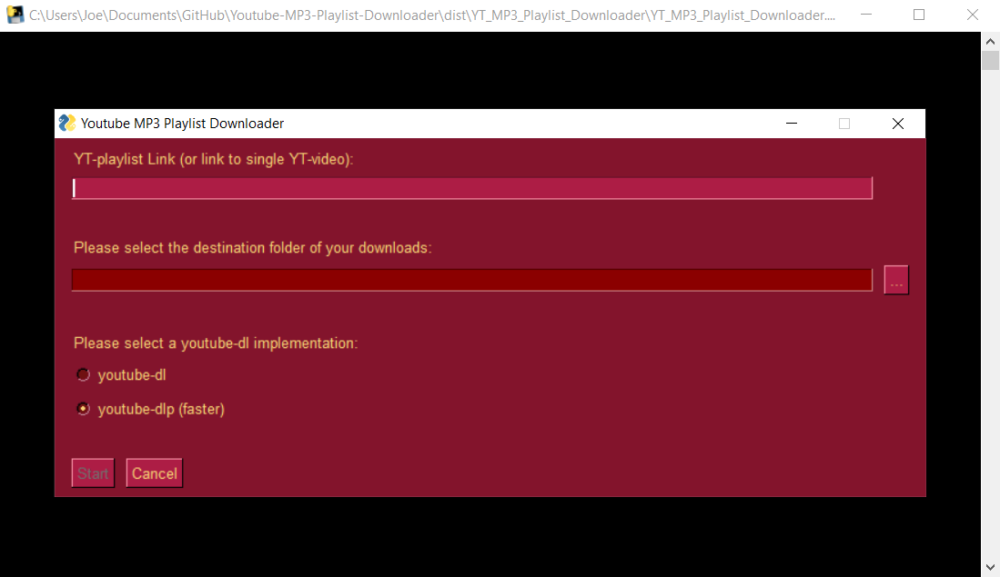
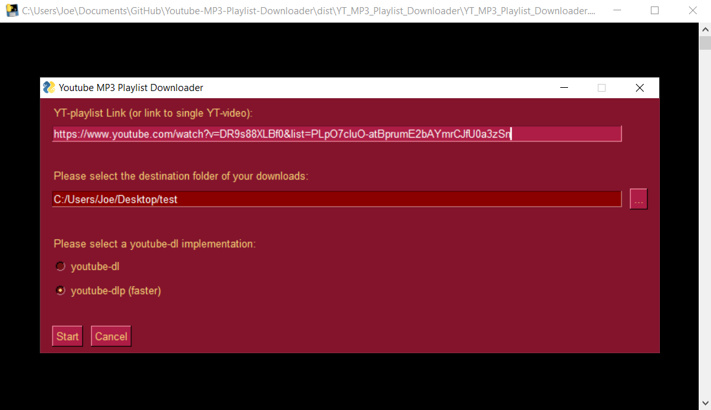
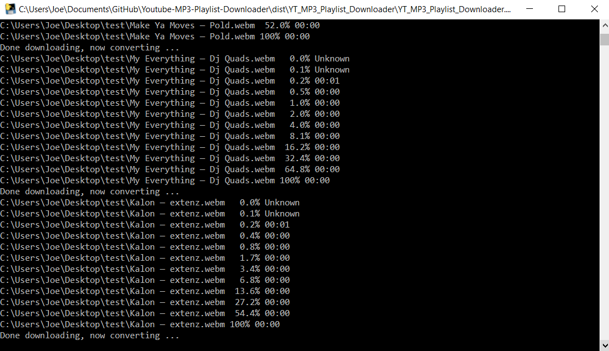
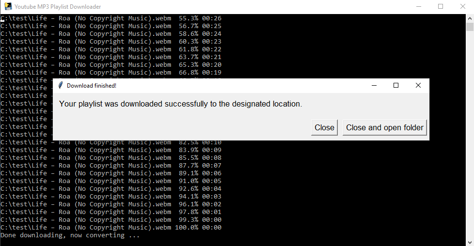

# Youtube MP3 Playlist Downloader
Let's you download entire youtube playlists as mp3 files.

This application is basically a script that makes it easier to download entire youtube playlists as mp3 files using youtube-dl. It also supports downloads of single files.

If you are running the python script through the interpreter make sure you have the requirements installed and you should be good to go. If you installed a release version you do not need to worry about dependencies or your python version. The binary works on its own.

When starting the application you will be prompted to provide the link to a playlist and a folder where you want your files to be stored. If you are trying to download the audio of a playlist created by yourself, please make sure the playlist is publicly accessible.

After a playlist has been added and a destination folder has been selected, you can press the "Start" button.

Now the dialog screen will close and the downloads will start.

After the entire playlist has been downloaded you will get a confirmation dialog in which you can select to open the destination folder.

Legal disclaimer:
This application should not be used to download copyrighted material without the copyright holder's consent. 
This application is intended as an easy way to download the audio of

a) your own YT-videos

b) videos you have obtained the permission to download from the copyright holder

c) videos that fall under the public domain or are otherwise free to be used under their license

WE DO NOT TAKE ANY RESPONSIBILITY, IF YOU DECIDE TO BREAK COPYRIGHT LAW. CIRCUMVENTING COPYRIGHT LAW OR ILLEGALY DOWNLOADING COPYRIGHTED MATERIAL IS A SERIOUS CRIME. PROCEED AT YOUR OWN RISK.

